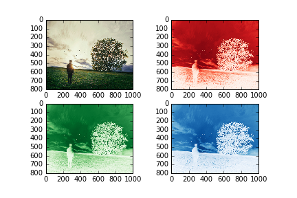
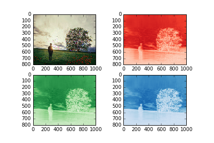

UECM3033 Assignment #2 Report
========================================================

- Prepared by: Ching June Tao
- Tutorial Group: T2

--------------------------------------------------------

## Task 1 --  $LU$ Factorization or SOR method

The reports, codes and supporting documents are to be uploaded to Github at: 

[https://github.com/chingjunetaoUTAR/UECM3033_assign2](https://github.com/chingjunetaoUTAR/UECM3033_assign2)

Explain your selection criteria here.

I will check is matrix A positive definite or not. If matrix A is positive definite, SOR method will be used to solve the system. If matrix A is not positive definite, LU decomposition will be used to solve the system. This is because when the matrix is not positive definite, we could not find an optimal ω for SOR method and it will not converge to the solution.
I use eigen values of matrix A and symmetricity of matrix A to check is it positive definite. 

Explain how you implement your `task1.py` here.

In solve(A,b)
property of matrix wil be checked and condition will be initialized.
This condition will decide whether LU decompotion or SOR method use to solve the system.

In LU decomposition, I use scipy.linalg.lu(A) to decompose matrix A to P, L and U.
P is Permutation matrix.
L is Lower Triangular matrix.
U is Upper Triangular matrix.
Permutation matrix is used in case the pivot element of first row of matrix A is not the largest, the algorithm might get error when solving the system.

$$ A = PLU  ,    Ax = b$$
$$ PLUx = b $$
$$ x =  U^{-1}L^{-1}P^{-1}b $$

x will be solved by using the equation above. 

In SOR method, optimal ω will be find by using the formula below. If matrix A is positive definite, optimal ω will be found and range of 0 < ω < 2. This ω will make the solution coverge to the solution faster.

$$ Q = \frac{1}{w}(D - wL) $$
$$ A = D-L-U $$
$$ w = \frac{2[1-{\sqrt{1-p(Kj^2)}}]}{[p(Kj)]^2} $$
where  $$Kj = D^{-1}(L+U)$$

$$ X^{k+1} = Q^{-1}(Q-A)X^{k} + Q^{-1}b$$

The iteration is set to be 20. The solution will converge within 20 iterations because optimal ω is used.

 

---------------------------------------------------------

## Task 2 -- SVD method and image compression

Put here your picture file (Tree.tiff)

RGB of Tree.tiff (ori_img.png)

How many non zero element in $\Sigma$?

There is N non zero element in $\Sigma$ .
In our case, there are 800 non zero element in $\Sigma$ .

Put here your lower and better resolution pictures. Explain how you generate
these pictures from `task2.py`.

Lower resolution picture. (lowResolution_Tree.jpg)

Better resolution picutre. (BetterResolution_Tree.jpg)

First, I get the RGB value from the image file. Then I use np.linalg.svd to decompose the R,G and B matrices into $\Sigma$, U and V. The $\Sigma$ I got is a vector with dimension of (800,1). I change it into a diagonal matrix which with a dimension of (800,1000). I keep the first 30 diagonal value for low resolution picture and let the remaining element become zero. For the better resolution picture, I keep the first 200 diagonal value and let the remaining element become zero. Lastly, I combine $\Sigma$, U and V into R, G and B matrices again. The new RGB values are use to generate the lower resolution image and better resolution image.

What is a sparse matrix?

A sparse matrix is a matrix in which most of the elements are zero.
In our case, we convert the vector $\Sigma$ to a diagonal matrix. We change the dimension of $\Sigma$ from [800,1] to [800,1000] which create a sparse matrix. There are 800 non zero element and 799200 zero element in our $\Sigma$.

-----------------------------------
use https://stackedit.io/editor to render the equation if you cannot read the equation in markdown file. 
last modified: 10/3/2016

